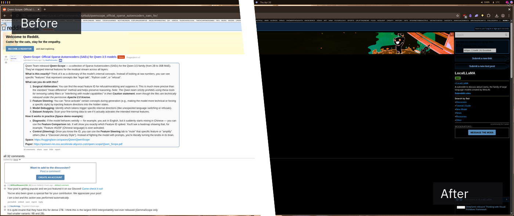
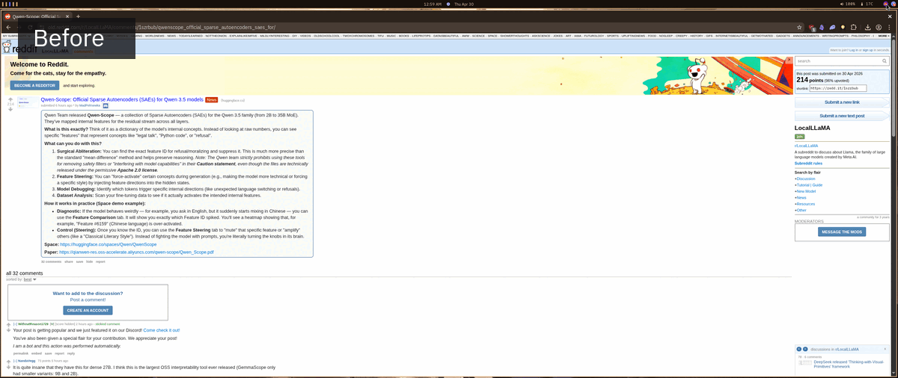

# LightsOut - Reader Mode

A small Chrome/Chromium Manifest V3 extension that toggles dark reader mode on the current tab.

## Features

- Toggle per tab from the extension popup.
- Keeps the enabled state after refreshing a tab.
- Uses Manifest V3.
- Includes a self-authored bulb icon.

## Install Locally

1. Download the repository as a ZIP from GitHub.
2. Extract `lightsout-main.zip`; it should unpack to a folder named `lightsout-main`.
3. Open `chrome://extensions` or `[browser name]://extensions`.
4. Enable **Developer mode**.
5. Click **Load unpacked**.
6. Select the extracted `lightsout-main` folder.

Use the toolbar button to turn LightsOut on or off for the active tab.

## Permissions

- `activeTab`: reads and updates the current tab when toggled.
- `scripting`: injects the reader mode stylesheet.
- `storage`: remembers whether LightsOut is enabled for a tab.
- `<all_urls>`: allows the extension to run on regular `http` and `https` pages.

## Files

- `manifest.json`: extension manifest.
- `popup.html`, `popup.css`, `popup.js`: popup UI and toggle behavior.
- `background.js`: reapplies LightsOut after tab refreshes.
- `reader.js`: injected page styling.
- `icon.svg`, `icons/`: source and generated extension icons.

## Tested On:

- Old Reddit
- Mediafire

If there's a site out there that doesn't play well with the extension reach out to me and I'll add support for it

## Comparison

